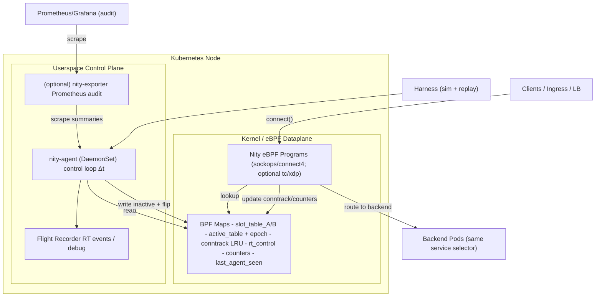

# Nity / Continuity — Architecture (Dataplane + Control Plane)

This document explains **how Nity is put together** and how each component exists to enforce the **Hydraulic Constitution**: continuity, stability, predictability, and safety—using an **Eulerian** control model (fields) rather than per-request “particle” tracking.

Nity is intentionally built as a **two-plane system**:

- **Dataplane (eBPF):** executes the *fast path* inside the kernel with **O(1)** work per connect/event.
- **Control plane (agent):** computes and projects a **field** (slot allocation + control knobs) on discrete ticks.

> Prometheus/Grafana are **auditability** tools, not the primary sensing substrate. The control loop uses **ms–s** signals (kernel + eBPF counters + local sensors).

---

## 1) Why Dataplane + Control Plane?

Kubernetes incidents often fail the same way: feedback loops arrive late (minute-level dashboards), reactions come after the “shape” of the failure is already established, and automation tends to be coarse (scale up/down after latency is already spiking).

Nity’s design bets on a different lever:

- **Per-event, in-kernel enforcement** (fast, local, deterministic)
- **Field-based control** (Eulerian): it reacts to *pressure fields* and *flow capacity*, not individual requests

This is how Nity aims to keep **continuity** even when conditions degrade:
- redistribute flow away from rising pressure
- damp changes to avoid oscillation
- protect the system boundary when capacity is insufficient

---

## 2) High-Level Component Map

### 2.1 Components

**(A) eBPF Dataplane (kernel)**
- Hooks: `sockops/connect4` and optionally TC/XDP later
- Responsibilities:
  - deterministic backend selection (slot-table + gear)
  - stickiness via conntrack LRU
  - admission enforcement (normal/soft/hard)
  - fail-safe behavior (hold/fallback) if the agent is stale
- Constraints:
  - **O(1)** work per event
  - no dynamic allocations
  - verifier-friendly code paths

**(B) Nity Agent (userspace, per-node)**
- Runs as a **DaemonSet**
- Responsibilities:
  - read fast signals (PSI, cgroups, eBPF counters, optional app aggregates)
  - compute backend pressure and weights
  - compute target slots and apply viscosity (slew-rate)
  - apply guardrails (monotonic skew guard)
  - write the **inactive** slot-table and flip epoch atomically
  - set control knobs (admission mode + budgets)

**(C) Audit Exporter (optional)**
- Can be inside the agent or a separate process
- Exposes low-cardinality, audit-grade metrics for Prometheus
- Goal: keep audit overhead bounded and separate from the core loop

**(D) Operator / Controller (optional)**
- Implements “superpowers” that Kubernetes does not provide fast enough by default:
  - fast scale hints, rollouts guardian, policy wiring, etc.
- Important: operator **must not** turn Nity into an opaque policy engine.
  - Nity remains deterministic and physics-grounded.

**(E) Harness (simulation + replay)**
- “Physics CI”: validates invariants (bounded cost, no blackholes, bounded flapping, etc.)
- Allows replay of flight-recorder traces to reproduce failures deterministically

---

## 3) Architecture Diagram (Mermaid)

> This is the canonical architecture view. Keep this in sync with the repo.

---

## 4) Data Flow (What Happens at Runtime)

### 4.1 Normal flow: connect admission → selection → stickiness

1) Client attempts to open a connection to a service VIP.
2) Dataplane checks **failsafe mode** (based on agent staleness):
   - normal / hold / fallback
3) Dataplane checks **admission_mode** (normal/soft/hard):
   - hard: deny fast
   - soft: budget-gated deny/allow
   - normal: proceed
4) Dataplane attempts **conntrack** lookup (stickiness):
   - hit: use the pinned backend
   - miss: pick a slot deterministically (gear), then map slot → backend
5) Dataplane records counters and returns the backend decision
6) Connection proceeds to the selected backend

Key property: this is **O(1)** and deterministic.

### 4.2 Control loop: pressure → weights → slots → epoch flip

Every tick (Δt), the agent does:

1) Read signals:
   - backend error/latency aggregates (from BPF counters or optional app summaries)
   - PSI / cgroup signals for node-local pathology
2) Compute pressure per backend: `P_b`
3) Convert to weights: `w_b ∝ 1/(P_b + ε)`
4) Convert to target slots: `s_target_b`
5) Apply viscosity: limit `Δs` per tick (slew rate)
6) Apply monotonic guard: refuse steps that worsen skew consistently
7) Write new field into **inactive slot table**
8) Flip `active_table` and increment `epoch` atomically
9) Update heartbeat timestamp (for failsafe)

---

## 5) The Field (What the Agent Writes, What the Dataplane Reads)

The “field” is the minimal set of state that turns fluid principles into deterministic decisions:

- **slot_table_A / slot_table_B**: route_key → backend_id
- **active_table**: indicates which slot table is active
- **epoch**: increments on each projection; used for coherence and debugging
- **conntrack LRU**: flow_key → backend_id (+ metadata)
- **rt_control** (per route group):
  - admission_mode (normal/soft/hard)
  - token bucket budgets (soft mode)
  - (optional) future flags
- **last_agent_seen_ts**: heartbeat for failsafe

The stable contract for these is specified in **RFC 0004**:
- `docs/rfc/0004-dataplane-contract-maps-keys.md`

---

## 6) Regimes vs States (Don’t Confuse Them)

Nity uses two layers of thinking:

### Regimes (posture / strategy)
Regimes are *interpretations* of system health over time:
- **Laminar:** stable flow, small corrections
- **Transition:** signals trending worse, firmer corrections, selective isolation
- **Crisis:** survival overrides demand (hard backpressure, stricter thresholds)
- **Recovery:** slow return (hysteresis), debt repayment, gradual reopening

Regimes are explained in:
- `docs/guide/regimes.md`

### States (concrete knobs that drive behavior)
States are concrete flags/modes set by the agent or derived by the dataplane:
- `admission_mode`: normal / soft / hard
- `failsafe_mode`: normal / hold / fallback
- backend state: healthy / degraded / isolated (internal classification)

States are explained in:
- `docs/guide/states.md`

The key is:
- **regime** = “how strict should we be?”
- **state**  = “what exactly is enforced right now?”

---

## 7) Deployment Model (Why the Agent is a DaemonSet)

### 7.1 Why DaemonSet is the right default
Nity is **node-local first** because its strongest signals and enforcement points are node-local:

- PSI and cgroups are per-node realities
- eBPF maps live on the node
- decisions need to be **near** the dataplane to remain timely and robust

A DaemonSet gives:
- one agent per node (local sovereignty)
- minimal network dependency (survives control-plane/API slowness better)
- clear failure containment: a node can enter HOLD/FALLBACK locally

### 7.2 Does it make the system less robust?
Not inherently. It changes the robustness *shape*:

- **More robust** against network/control-plane issues: each node continues coherently.
- **Less centralized**: cluster-global decisions require extra coordination (future).

For MVP, local-first is a feature:
- it aligns with the constitution’s “Local Sovereignty” principle
- it matches the physical reality: the kernel is local

For a future coordinator, you can add:
- a (small) optional leader for cross-node strategy (not required for MVP)

---

## 8) What Nity Can and Cannot “Reroute”

A common misconception is “Nity can always reroute traffic away from a bad pod.”

That is only true **within an equivalent backend set**:
- traffic for *Service A* can only go to pods that are legitimate backends of *Service A*

If there is **one replica only**, Nity cannot invent capacity.
It can still preserve continuity by:
- entering soft/hard admission modes to prevent collapse
- isolating pathological flows (if policies exist)
- emitting scale hints (operator extension)

This boundary is explicitly stated in **RFC 0001** and **RFC 0005**:
- `docs/rfc/0001-control-loop.md`
- `docs/rfc/0005-protocol-scope-l4-vs-l7.md`

---

## 9) Failure Modes and “Graceful Degradation”

Nity is designed to degrade safely:

### 9.1 Agent slow or dead
- Dataplane detects staleness via heartbeat age.
- Transitions:
  - **HOLD:** freeze field (inertia)
  - **FALLBACK:** deterministic selection without new projections
- Spec: `docs/rfc/0003-epoch-flip-failsafe.md`

### 9.2 Backend degradation
- Pressure rises (errors/latency/queue proxy)
- Slots shift gradually (viscosity)
- If necessary, selective isolation + drip probing (constitution)

### 9.3 Systemic overload
- Conductance drops / TTF goes low / PSI stalls
- Admission moves from normal → soft → hard
- Spec: `docs/rfc/0002-backpressure-modes.md`

---

## 10) Observability and Auditability

Nity distinguishes:
- **RT signals (for control):** fast, local, often high rate → kept in memory / flight recorder
- **Audit metrics (for humans):** low-cardinality summaries → Prometheus

Recommended docs:
- `docs/config/knobs.md` (what knobs mean and defaults)
- `docs/ops/runbook.md` (what to do operationally)

---

## 11) Security Boundaries

Physics cannot violate policy.

- Nity must never route across service boundaries.
- Enforce RBAC so only the agent writes maps/control.
- Optional future: integrate with network policy / identity rules as “hard law”.

---

## 12) Repository Mapping (Where Architecture Lives in the Repo)

- `bpf/` — kernel programs + shared headers + map definitions
- `cmd/nity-agent/` — userspace agent main
- `internal/agent/` — control loop, sensors, dataplane writer
- `docs/rfc/` — RFCs (0001–0006)
- `docs/guide/` — regimes and states (how to reason about behavior)
- `harness/` — simulation + replay (invariants CI)

---

## 13) How This Document Relates to RFCs

This document gives the **mental model** and **component responsibilities**.

Precise contracts are in RFCs:
- RFC 0001: control loop computation
- RFC 0002: admission modes
- RFC 0003: epoch flip + failsafe
- RFC 0004: maps/keys contract
- RFC 0005: L4 vs L7 scope
- RFC 0006: invariants harness

---

## 14) Checklist (Architecture Completeness)

- [ ] Dataplane hook chosen and justified (MVP: sockops/connect4)
- [ ] A/B slot tables + atomic flip implemented
- [ ] Conntrack stickiness implemented and bounded
- [ ] Heartbeat-based HOLD/FALLBACK implemented
- [ ] Admission modes implemented (normal/soft/hard)
- [ ] Agent control loop produces coherent field and flips epoch
- [ ] Runbook and knobs documented
- [ ] Harness validates the invariants

---

**End of Architecture document.**